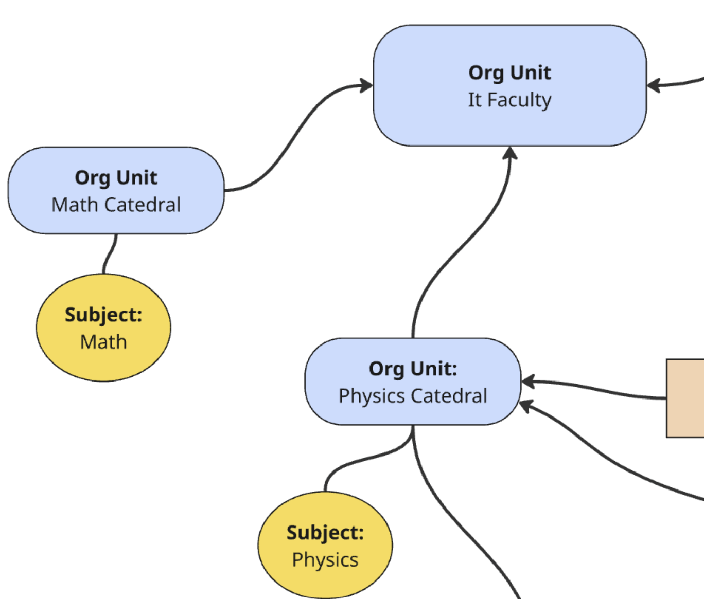
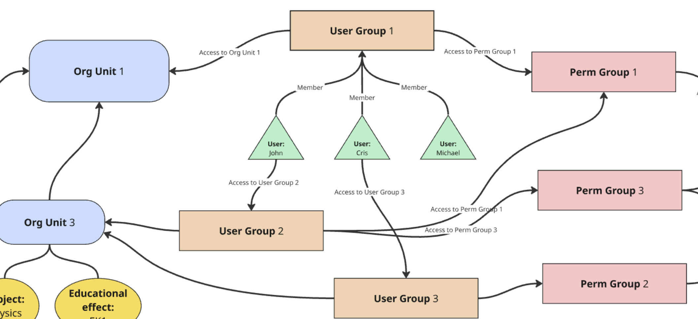
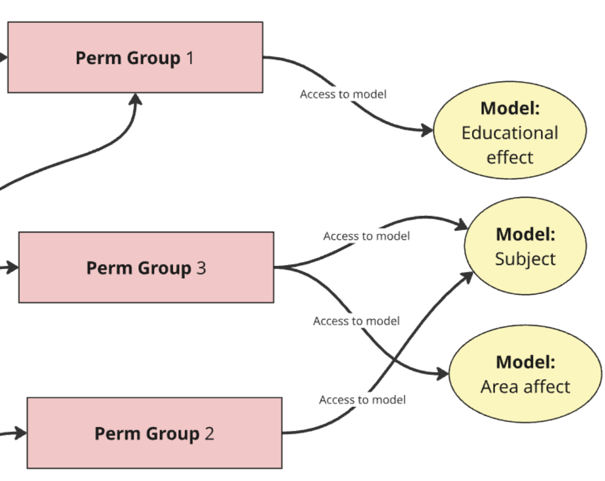
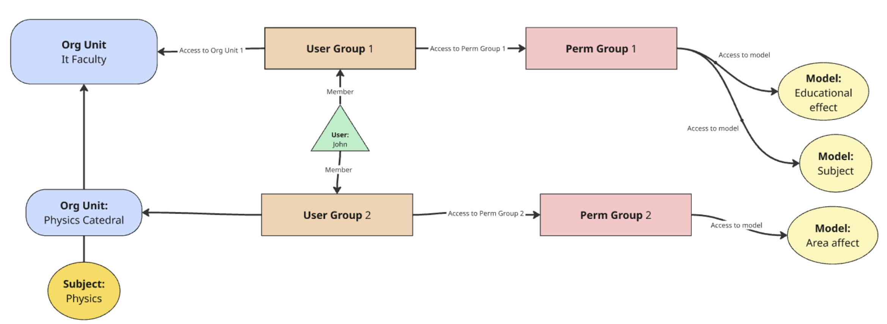

# Django Hierarchical Permissions

## Introduction to models

The system is built upon several **core models**: **OrganizationalUnit**, **UserGroup**, **Group** (Django’s default
`Group` model, in document it'll be described as `Permission Group` to avoid confusion with `User Group`), and **User
** (Django’s default `User`
model).  
These models are interconnected through well-defined relationships, providing the foundation for the system’s
functionality and enabling **flexible**, **granular access control**.

### Organizational units

**Organizational Unit** is a model that represents a logical container for other objects within the system.  
It supports hierarchical structuring through a self-referential `parent` field, allowing one organizational unit to be
nested within another.

#### Example – Organizational Units Hierarchy

The diagram above illustrates a sample hierarchy of organizational units.

- At the top of the structure, we have the **IT Faculty**, representing a higher-level organizational unit.
- Beneath it, there are two child units:
    - **Math Cathedral**, which is the parent of the subject *Math*
    - **Physics Cathedral**, which is the parent of the subject *Physics*

This structure reflects the hierarchical organization of academic units and subjects.  
Each subject is linked to a specific department (*Cathedral*), which in turn belongs to a higher-level unit (
*Faculty*).  
Such a setup enables permission inheritance and logical access scoping within the system.

### User groups

**User Group** acts as a connector between the `OrganizationalUnit`, `User`, and `Permissions Group` models.  
It defines many-to-many relationships with all of these, serving as a flexible way to associate users with specific
units and permission groups.

#### Example – User Groups Structure

The diagram above illustrates how **User Groups** serve as a central connector between users, organizational units, and
permission groups.

- **Users** such as *John*, *Cris*, and *Michael* are shown as **members** of one or more **User Groups**.
- Each **User Group** is linked to specific **Organizational Units**, defining the organizational context (scope) in
  which the group operates.
- User Groups are also connected to one or more **Permission Groups**, which define what actions members of the group
  are allowed to perform (e.g., `view`, `change`, `delete`).

For example:

- *John* belongs to **User Group 2**, which grants him access to **Org Unit 3** and permissions defined in **Permission
  Group 3**.
- *Cris* is a member of **User Group 1** and **User Group 3**, inheriting access to both **Org Unit 1** and **Org Unit 3
  **, as well as permissions from **Permission Groups 1** and **3**.
- *Michael* is connected to **User Group 1**, gaining access to **Org Unit 1** and **Permission Group 1**.

This model provides a clear and scalable structure for **role-based access control**, where permissions are not assigned
directly to users, but rather inherited through

### Permission Group

**Permission Group** defines a set of specific access rights tied to particular models or model instances.  
It enables fine-grained control over which users (through user groups) are allowed to perform specific actions on
various parts of the system.

Examples of permission groups include:

- **Teachers**
- **Lead Instructors**
- **Curriculum Administrators**

#### Example – Permission Groups and Model-Level Access

The diagram above shows how **Permission Groups** define access to specific models in the system and determine what
actions can be performed on them.

In the example:

- **Permission Group 1** grants access to the model **Educational Effect**
- **Permission Group 2** is linked to the model **Area Affect**
- **Permission Group 3** provides access to both the **Subject** and **Area Affect** models

These permission groups are not assigned directly to users, but to **User Groups**, which users belong to.  
This structure allows users to inherit access rights based on their role and group membership.

### User

**User** defines user of the system. When `is_staff` value `True` then user has got access to admin panel.
When `is_superuser` value `True` then user has got access to everything in the admin panel.

## Other concepts in permission system

### Permission codenames

**Permission codename** is string value representing specific permission. **Codename** is stored in database in
`Permissions` table. Permission codenames have their own syntax. Two variants are foreseen:

`AppLabel.PermissionSubType_Action_Model`

and

`AppLabel.Action_Model`

Where `PermissionSubTypes` and `Actions` are defined in `swierk_permissions.constants`. First variant is used in more
complex cases. Can be created using `PermissionCreationService`. Rules could be assign in app where model is defined in
`apps.py` file. Second variant is created by default and in present form doesn't allow assigning rules to codenames.

### Permission constants

#### PERMISSION_DIVIDER_BY_TYPES

There are three main types of permissions.

- `regular` - permissions which operates only on codenames. If user has it, and object is in scope of organizational
  unit permission is granted.
- `olp` - permissions which operates on codenames and rules. If user has it, and object is in scope of organizational
  unit, rule assigned to olp permission is checked. If rule is fulfilled then permission is granted.
- `hardcoded` - permissions which operates only on rules. They are not stored in database. If rule is fulfilled then
  permission is granted.

#### PermissionSubType

**PermissionSubType** is enum with propositions of permissions needed in the project. Can be used in
`PERMISSION_TYPES_LABELS` or in `PermissionCreationService`.

#### PERMISSION_TYPES_LABELS

**PERMISSION_TYPES_LABELS** is dictionary which contains lambda functions to override names of permissions. We are using
it
in `PermissionCreationService`.

#### Action

**Action** is enum with propositions of actions needed in the project. Right now **Action** enum contains default
actions
like **add, delete, change, view**

## Flow

Permission-checking process:

1. The user John attempts to access details of the Physics subject (e.g., its course card).

2. The system identifies which organizational unit the subject is associated with.
   In this case, the Physics subject is directly linked to the Department of Physics (i.e., it is a child of that unit).

3. The system retrieves all User Groups associated with the Department of Physics.

4. It checks whether the user belongs to any of those user groups.

5. If the user is a member of at least one group, the system proceeds to the related Permission Groups and checks:
    - Whether the user has specific permissions for the given model.
    - What type of permissions are assigned: view, change, delete, edit, etc.

6. If a relevant permission is found (e.g., view), the user is granted access to the resource (e.g., to read a field,
   element, or module).

7. If no valid permissions are found, the system moves one level up in the organizational hierarchy — for example, from
   the Department of Physics to the Faculty of Physics.

8. Steps 3–6 are repeated until:
    - a matching permission is found, or
    - the highest level in the hierarchy is reached (e.g., the university) without success.

## Bibliography

Link: [Django permissions](https://docs.djangoproject.com/en/5.2/topics/auth/default/)

Link: [Rules](https://pypi.org/project/rules/)

## Authors

- Jakub Jakacki
- Marek Turkowicz

## Last changed

Date: **16.06.2025r.**